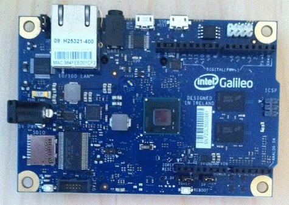

# Intel Galileo Developer

Common Debian Linux developer build instructions for the Intel Galileo board.

[Intel Galileo Website](http://www.intel.com/content/www/us/en/do-it-yourself/galileo-maker-quark-board.html)

* Default logins

User: user Password: user 

User: root Password: root 

* [Creating Intel Galileo Debian build server.](Documentation/GalileoDebianBuildNotes.txt)

* [Installing C# mono on Galileo board](http://galileo.codeplex.com)
